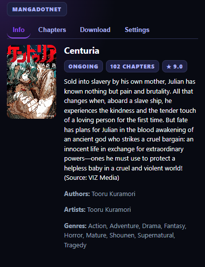

<div align="center">
  

  # MangaDotNet Extension

  [](#)
  [](#)
  [](#)

  *A premium, high-performance Chrome extension for bulk downloading manga chapters from MangaDotNet.*
</div>

---

## 📸 Preview

Here is a look at the modern, clean interface of the extension:

<div align="center">
  
</div>

---

## ✨ Features

- **⚡ Granular Parallel Downloads**: Configure separate concurrent downloads for chapters and images to maximize bandwidth efficiency.
- **📁 Multi-Format Export Support**:
  - `cbz` (Comic Book Archive)
  - `zip` (Compressed archives)
  - `pdf` (High-quality documents with canvas WebP-to-PNG fallback conversions)
  - `images` / `folder` (Loose images saved in structured subfolders)
- **🗂️ Clean Folder Organization**: Saves files using the structured layout: `MangaName/Chapter_Number/...`
- **💾 Persistent Popup State**: Popup saves selected chapters, active tabs, and filters in local storage to prevent loss of state on window click-away.
- **🔄 Auto-clean Queue**: Completed downloads are automatically removed from the active queue, keeping the interface uncluttered.
- **🎨 Glassmorphic Dark UI**: Modern dark theme designed with curated palettes, CSS transitions, and sleek loader micro-animations.

---

## 🛠️ Installation

> [!TIP]
> **Quick Install**: If you do not want to compile the extension yourself, you can download the pre-packaged extension zip file directly from the [Releases](https://github.com/Yui007/mangadotnet-extension/releases) tab and load it unpacked.

### Building from Source:
1. Clone or download this repository.
2. Build the production assets:
   ```bash
   cd extension
   npm install
   npm run build
   ```
3. Open your browser and navigate to `chrome://extensions/`.
4. Enable **Developer mode** in the top right corner.
5. Click **Load unpacked** and select the built `dist` folder located inside the `extension/` directory.

---

## 🚀 Usage

1. Open any manga details or reader page on [MangaDotNet](https://mangadot.net/).
2. Click the extension icon in your Chrome toolbar.
3. Select your desired chapters and choose the export format.
4. Customize concurrency, retry settings, and quality parameters in the **Settings** tab.
5. Click **Download Selected** and monitor speed, remaining time (ETA), and progress bars under the **Download** tab.

---

## 📦 Developer Guide

### Project Structure
- `extension/src/background/`: Background service worker orchestrating concurrency queues and file writes.
- `extension/src/downloads/exporters/`: Modules for packaging images to Zip, CBZ, PDF, and folder exports.
- `extension/popup/`: Popup UI components, event handlers, and styles.

### Development Commands
```bash
# Watch files for fast development compilation
npm run dev

# Run all unit and integration tests (Vitest)
npm run test
```

---

<div align="center">
  <sub>Built with ❤️ for the MangaDotNet community.</sub>
</div>
